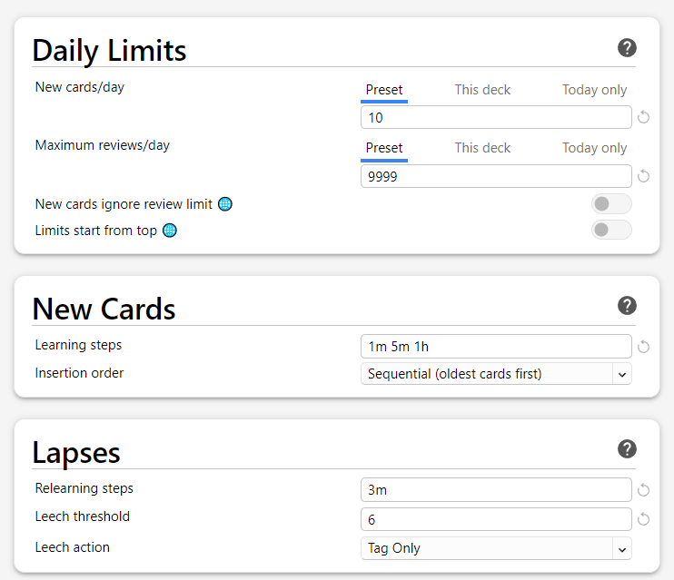
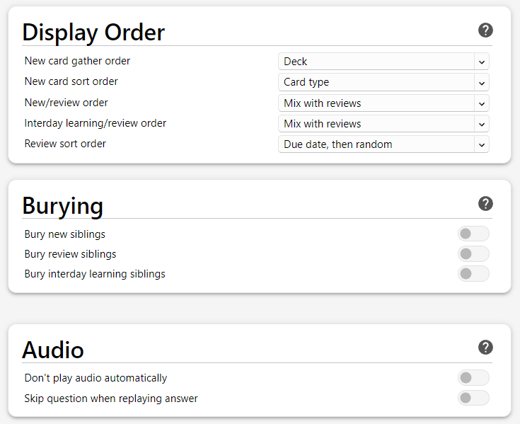
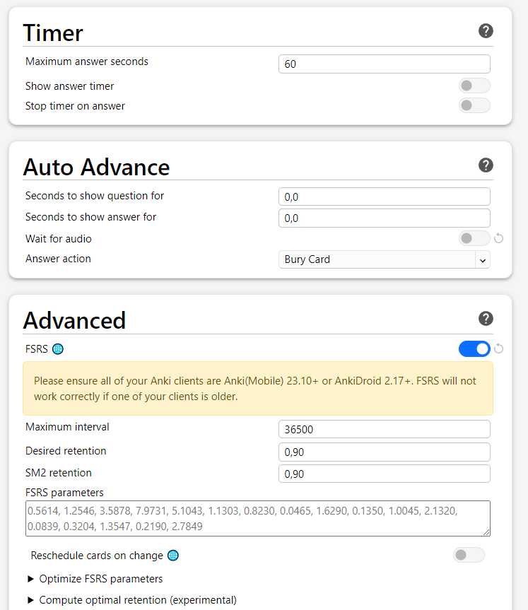

Anki
===

I used the setup guide from [xelieu - the lazy guide](https://xelieu.github.io/jp-lazy-guide/setupAnki/)  
And the guide from [donkuri - Immersion-Based Japanese Learning](https://donkuri.github.io/learn-japanese/setup/#installing-anki).

#### Download Anki

Download [Anki 32.12.1 Qt6](https://apps.ankiweb.net/).

Creating an account

You technically don't need an Anki account.  
The account is only for syncing and backing up your decks and data.  

Simply click on `sync` and Anki will check your current data with the data stored on [AnkiWeb](https://ankiweb.net/about).  
If you are not logged in, Anki will ask you to sign in or create a new account.  
You can find your account under:
- `Tools`
- `Preferences`
- `Syncing`

Setting up Anki

**Note:**  
If you used Anki a lot in the past and you like the v2 scheduler, you don't need to change to FSRS.  
FSRS is a new algorithm for scheduling reviews. It's highly recommended to use the new scheduler  
[but don't forget to do a backup of your deck, just in case].

First of all, we delete the shortcut for the `hard` and `easy` buttons.  
It's best to not use the hard and easy buttons, see [FSRS4Anki Q8](https://github.com/open-spaced-repetition/fsrs4anki/blob/main/docs/tutorial.md#faq).  
"In fact, FSRS is actually more accurate for people who rarely use "Hard" and "Easy" than for people who use all 4 buttons a lot"  
If you don't use FSRS, it's still better to not use the `hard` and `easy` buttons, because you could end up in the so-called [Ease Hell](https://readbroca.com/anki/ease-hell/).

Go to:  
- `Tools`
- `Preferences`
- `Review`
- Delete `Answer keys` for `Hard` and `Easy`
- Make sure `Paste clipboard images as PNG` is **not** checked

Click on the `⚙` next to a deck
- click on `option`
- scroll to the bottom and enable `FSRS`
- apply the following options from the pictures

  
  
  

#### Change settings to your liking

If you are writing Kanji down while reviewing,  
you should adjust some parameters.  
This depends on how long you need to write down the kanji   
and then reviewing it:  
- `Learning steps`: e.g., 2m 5m 1h
- `Maximum answer seconds`: e.g., 120

You may also change the display order:
- `New/review order`
- `Interday learning/review order`

Anki Add-ons

#### Why do I need Add-ons?
If you want to mine vocabularies, it takes a good amount of time to create a new card.  
You would need to configure a note type for Anki, defining fields, and the font and back template, and the style for the note type.  
After that, you can add cards to your deck, but you need to do this manually.  
With add-ons, you can automate the process of adding a new card to Anki.  
[See](XXX)

**Note:**  
Please read the description for [AJT Mortician](https://ankiweb.net/shared/info/1255924302) on the add-on page.  
You don't need to install the [Local Audio Server for Yomichan](https://ankiweb.net/shared/info/1045800357). 
It only speeds up the process of getting the audio for a word.  
See more under [mining](XXX):

Highly recommended:  
[AJT Japanese](https://ankiweb.net/shared/info/1344485230) Number: `1344485230`  
[AJT Mortician](https://ankiweb.net/shared/info/1255924302) Number: `1255924302`  
[AnkiConnect](https://ankiweb.net/shared/info/2055492159) Number: `2055492159`  
[Yomichan Forvo Server](https://ankiweb.net/shared/info/580654285) Number: `580654285`  
[FSRS4Anki Helper](https://ankiweb.net/shared/info/759844606) Number: `759844606`

Recommended:  
[Review Heatmap](https://ankiweb.net/shared/info/1771074083) Number: `1771074083`  
[Local Audio Server for Yomichan](https://ankiweb.net/shared/info/1045800357) Number: `1045800357`  
[Generate Batch Audio](https://ankiweb.net/shared/info/1156270186) Number: `1156270186`  
[Batch Editing](https://ankiweb.net/shared/info/291119185) Number: `291119185`

Optional:  
[More Overview Stats 2.1](https://ankiweb.net/shared/info/738807903) Number: `738807903`  
[Pass/Fail](https://ankiweb.net/shared/info/876946123) Number: `876946123`  
[Progress Graphs and Stats](https://ankiweb.net/shared/info/266436365) Number: `266436365`  
[Study Time Stats](https://ankiweb.net/shared/info/1247171202) Number: `1247171202`  

After this, you can download some [Anki decks](xxx).
