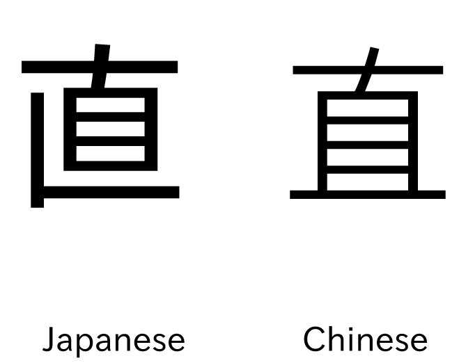

Are you using a Japanese font? 
===

How does 直 display for you?

This is really important for Anki, Yomitan, your browser etc.  
[Guide: Are you using the right font?](https://learnjapanese.moe/guide/#are-you-using-the-right-font)

Installation for windows

- Press `WinKey`
- search `Power Shell`
- right click `open as administrator`
- enter: `
Get-WindowsCapability -Online -Name Language.Fonts.Jpan~~~und-JPAN* | Add-WindowsCapability -Online
`

Apply font for Chrome

- open Chrome
- open the menue `⋮`
- Setting
- Appearance
- Customize fonts

Select the following fonts:
- Standard font: `Meiryo UI`  
- Serif font: `Yu Mincho `
- Sans-serif font: `Meiryo`  
- Monospace: `MS Gothic`

[source](https://learnjapanese.moe/font/)

Apply font for Anki

#### Reviewing
Check if `直` gets diplayed correctly on the cards while reviewing:
- Click on browse
- Select / create a creade with `直`

If it gets not diplayed correctly, the font is installt incorrectly or not detected.  
Please ask for help or see: [TheMoeWay Font Anki](https://learnjapanese.moe/font/#anki).  
Maybe you need to force it.

#### Edit fields 
Check if `直` gets diplayed correctly on the edit fields in the note type.
If not, you can change the font for every edit field.  
This is not really nessesary but still good to see the kanji displayed correctly on the edit fields. 
- click on `Fields` 
- select a field, where japanese text is supposed to be displayed
- change `Editing Font` to a japanese font:
- e.g. `Noto Sans JP`

Don't like Meiryo UI?

#### Noto Sans JP

If you like you can use the [Noto Sans](https://fonts.google.com/noto/specimen/Noto+Sans+JP) font.

