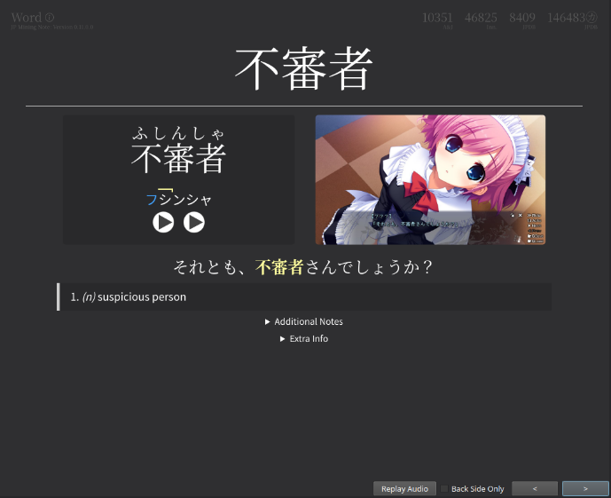

Animecards
===

I used the setup guide from [JP Mining Note](https://arbyste.github.io/jp-mining-note/setup/) <br>

We are using the `jp mining note` or more commently known as `Anime cards`.

<details>
<summary>JP Mining Note Type</summary>

### Installing

The same steps are also found in the [guide](https://arbyste.github.io/jp-mining-note/setup/). <br>

#### Automatic way
If you have python installed and basic git and command line knowledge, <br> you can use the automatic method of installing the note type: <br>
``` 
git clone "https://github.com/arbyste/jp-mining-note.git"
cd jp-mining-note

:: Ensure you have Anki open, and with anki-connect running
:: Also ensure that you have python 3.10+ installed.
:: It *MAY* work with lower versions of python, but I make no such guarantee. ;)
python tools\install.py
```


#### Manual way
Download the Note Type: <br>
- Go to the [release page](https://github.com/arbyste/jp-mining-note/releases)
- Download `{version}-jpmn_example_cards.apkg`

Import the Note Type to Anki: <br>
- Open Anki
- Go to `File`
- `Import...` the `jpmn_example_cards.apkg`

Download the custom fonts: <br>
- Download the 4 `.otf` files from the [media folder](https://github.com/arbyste/jp-mining-note/tree/master/media)
- Click on the `.otf` file
- Click on the download button at the top right

Import the custom fonts to Anki: <br>
- Press `WinKey` + `r`
- Enter `%Appdata%`
- Navigate to `Anki2/YOUR_PROFILE_NAME/collections.media`
- Move the 4 `.otf` files into the `media folder`

#### Verfying the Note Type

See [JP Mining Note](https://arbyste.github.io/jp-mining-note/setup/)

You sould see a new deck `JPMN-Examples` in your collection. <br>
- Go to `Browse`
- Select `JPMN-Examples`
- Press `Preview`

View one of the cards an mkare sure, the card looks similar to the one in the pictures below: <br>

 <br>
 <br>

(The following list is a one to one copy from the Setup Page from [JP Mining Note](https://arbyste.github.io/jp-mining-note/setup/))

1. The fonts should match with the above example. <br>If the fonts don't match, try restarting Anki. <br>If the fonts still don't match, the note was likely installed with "Option 2: The Manual Way". <br>Please verify you manually installed the fonts and placed them in the correct folder (see steps 3 and 4).

2. Notice how at the top left corner, the info circle (the "i" encased within the circle) is the default grey color. <br>If this circle is red or orange, there may be something wrong with the template. Please see this section for basic troubleshooting.

3. Clicking on the image to zoom should work out of the box. <br> Kanji hover may not work yet. If it doesn't work, read the Anki-Connect setup instructions on the next page. <br>If the image suddenly appears without a zoom animation, then you must [enable animations on Anki](https://arbyste.github.io/jp-mining-note/setupanki/#enable-animations-2161-2163).

4. If the furigana on your card seems to appear higher above the kanji compared to the picture, see the [Fix Ruby Positioning](https://arbyste.github.io/jp-mining-note/uicustomization/#fix-ruby-positioning-for-legacy-anki-versions) option.

5. If the frequency list on the top right appears to be squished (with no spacing between the elements) see the FAQ on [fixing the frequency list display](https://arbyste.github.io/jp-mining-note/faq/#the-frequency-list-display-looks-squished).


#### How do I use the JP Mining Note?

Please check how to use the jp mining note and how you can change the settings to suite your preferences. <br>
For that whatch the Videos under `Gui`, `Fields` and `Card Creation` form [JP Mining Note Homepage](https://arbyste.github.io/jp-mining-note/).

</details>
<details>
<summary>CSS Injector</summary>

For reference, see [CSS Injector by JP Mining Note](https://arbyste.github.io/jp-mining-note/setupanki/#css-injector).

[CSS Injector](https://ankiweb.net/shared/info/181103283) Number: `181103283`

Delete the old `field.css` and `editor.css`: <br>
- Press `WinKey` + `r`
- Enter `%Appdata%`
- Navigate to `Anki2\addons21\181103283\user_files`
- Delete `field.css` and `editor.css`

Or simply open a command prompt and:
```
:: be sure to change USERNAME to your computer username!

del "C:\Users\USERNAME\AppData\Roaming\Anki2\addons21\181103283\user_files\field.css"
del "C:\Users\USERNAME\AppData\Roaming\Anki2\addons21\181103283\user_files\editor.css"
```

Creating a Symbolic link to the new `field.css` and `editor.css`: <br>
**Make sure to change**: <br>
`USERNAME` to your computer username <br>
`PROFILENAME` to your Anki profile name <br>

Open cmd: <br>
- Press `WinKey`
- Enter `cmd`

After that **change the `USERNAME` and `PROFILENAME`!** <br>
and enter the following command: <br>
```
:: be sure to change USERNAME to your computer username and PROFILENAME to your Anki profile.
:: There are **two** USERNAME's to replace, and **one** PROFILENAME to replace
:: in the commands below.
:: Make sure to replace all the fields!

mklink "C:\Users\USERNAME\AppData\Roaming\Anki2\addons21\181103283\user_files\field.css" "C:\Users\USERNAME\AppData\Roaming\Anki2\PROFILENAME\collection.media\_field.css"
mklink "C:\Users\USERNAME\AppData\Roaming\Anki2\addons21\181103283\user_files\editor.css" "C:\Users\USERNAME\AppData\Roaming\Anki2\PROFILENAME\collection.media\_editor.css"
```

After that, restart Anki and check if your installation was successful; <br>
it should look like this:


</details>
<details>
<summary>Edit AJT Japanese Config</summary>

Copy the AJT Japanese config from my [Dropbox](https://www.dropbox.com/scl/fi/eyuhq0hgvq8ceh7hbxpov/AJT_Japanese_Config.json?rlkey=zw6eyhob50fz4122pj5h7m53n&dl=0)

Go to: <br>
- `Tools`
- `Add-ons`
- select `AJT Japanese`
- click on `config`
- past the config from the dropbox into it
- restart anki that the changes take effect

</details>
<details>
<summary>Yomitan Anki settings</summary>

For reference, see [CSS Injector by JP Mining Note](https://arbyste.github.io/jp-mining-note/setupyomichan/#yomichan-fields).

Go to Anki and create a new deck for mining:
- Press `Add`
- Select the `Japanese Mining Note`
- Click on `Deck`
- Click on `Add`
- Create a new deck, e.g., "Mining"

For your information, if you want to create subdecks, you can easily do so by putting `::` in the name. For example, if you want to have a subdeck named "YouTube", you would add a deck named `Mining::YouTube`.

Go to Yomitan Setting: <br>
- Navigate to the `Anki` section
- Select `Anki card format...`
- Set `Deck` to your newly created Anki deck
- Set `Model` as `JP Mining Note`

For more settings, see how the [JP Mining Template works](https://arbyste.github.io/jp-mining-note/).

</details>