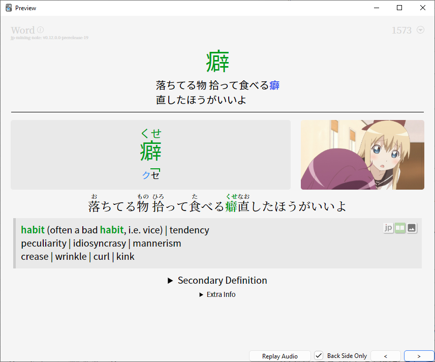
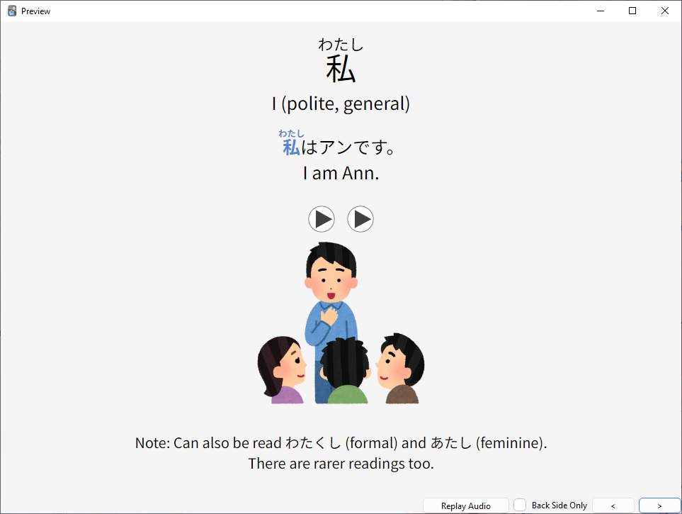
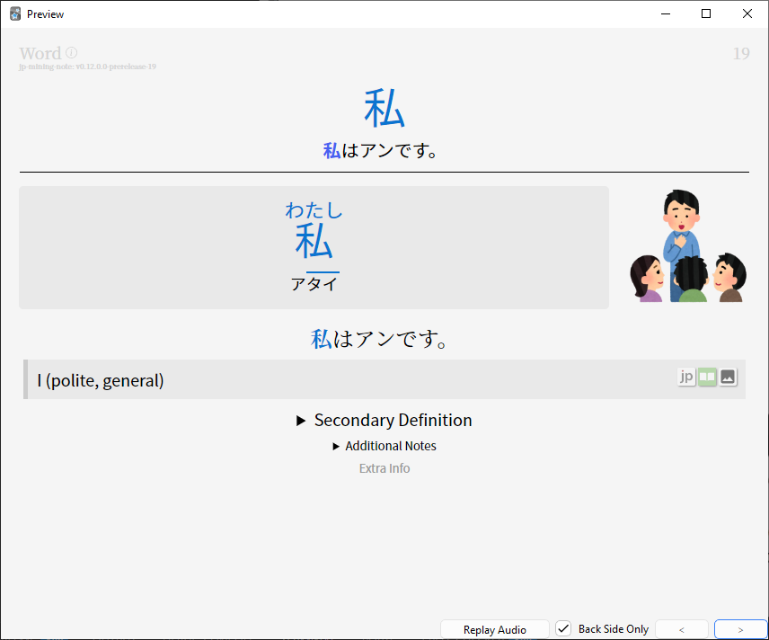
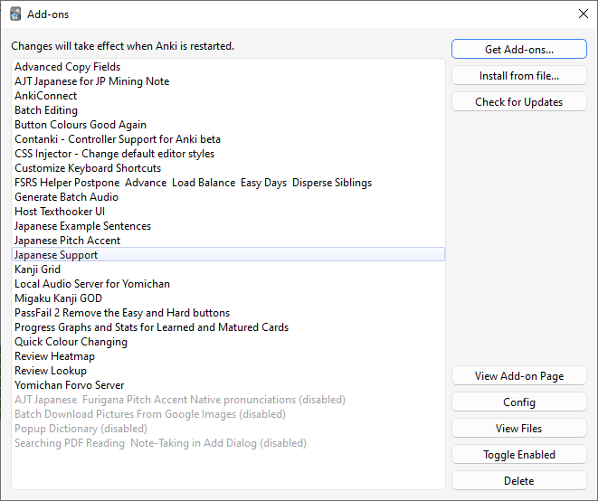

# Essenzial

Es geht darum folgendes aufzusetzen:

[Anki](https://apps.ankiweb.net/) (SRS als Karteikartensystem und seit zwei Jahren mit dem [FSRS Algo](https://faqs.ankiweb.net/what-spaced-repetition-algorithm.html)

[Yomitan](https://yomitan.wiki/) als Wörterbuch im Browser aufzusetzen (Früher Yomichan)

[TheMoeWay](https://learnjapanese.moe/resources/) Bester Guide!!! Beinhaltet alle Ressourcen die ich genannt haben und noch mehr! 

Als erstes Anki Denk:

- [Kaishi](https://ankiweb.net/shared/info/1196762551) (Das Beste Einsteiger Deck!)
- [Core 2.3k](https://anacreondjt.gitlab.io/docs/coredeck/) (Alternative zu Kaishi. Der Guide ist veraltet!)

!!! Info
    Ich habe das Kaishi Deck für die JP Mining Note konvertiert und personalisiert. Sieht viel besser aus und bietet mehr.
    Einfach anschreiben, dann verlink ich das über DropBox 

Ein Anki Setup findet sich im [TheMoeWay Guide](https://learnjapanese.moe/guide/#quick-anki-setup), als auch von mir geschrieben unter [Anki Setup](../setup/AnkiSetup.md)

### Anki Template

Für Anki Note Types (Templates) würde ich ganz ganz stark das [JP Mining Note](https://arbyste.github.io/jp-mining-note/) empfehlen. (Ich nutze die Pre-Released Version und hab die selbst gebaut ([Dev Branche](https://github.com/arbyste/jp-mining-note/tree/dev) auf GitHub))

Was das Template bietet:

- Bild kann mit einem Klick vergrößert werden
- Direkter Pitch Accent Support über Farben und Graph
- Furigana (kleine Hiragana über den Kanji) werden über den Satz bei einem Mouse-Hover angezeigt
- Extra Definitionen und Erklärungen können hinzugefügt werden
- Es wird die Word Frequency oben Rechts angezeigt
- Kennzeichnung, wenn das zu lernende Kanji eine gleiche Aussprache oder Schreibung verwendet, wie ein Kanji im Deck
- Direkte Verlinkung zum Wörterbuch 
- Erkennung und Tagging von doppelten Wörtern
- Wörter mit ähnlichen Kanji können mit einem Mouse-Hover im Deck nachgeschlagen werden.  
 
So sieht gerade meine Anki Karten aus:

Im direkten Vergleich Kaishi normal und als Mining Note Type:

# Input ist das Ziel

### So schnell wie möglich mit Input zu beginnen. 

Damit das Lernen wirklich los gehen kann, **müssen** die Hiragana und Katakana gelernt werden. 
Gerne kann das Lesen mit den ersten Lektion Texten aus dem Buch Japanisch Schritt für Schritt getestet werden. 
Ich habe die ersten Lektionen abgetippt und mit Furigana versehen - siehe [Lektion Eins](../lesson_texts/第1課　「食べますか」.md).

!!! Tip
    Ich hab die Hiragana und Katakana schon mehrfach erfolgreich in einem Tag beigebracht. 
    Bei Interesse gerne melden, habe sehr viel Spaß dran das lesen Beizubringen

Wir wollen so schnell wie möglich Richtung Immersion-Based learning zu kommen.

Das bedeutet viel Japansich konsumieren und wenig Zeit mit der Erstellung von Anki Karten verbringen. Sprich Karten werden automatisch per Knopfdruck erstellen.

Das geht bei:

- Anime / Offline, Online, Netflix, etc. pp.
- Jeder Internet Seite
- Bücher / Novellen
- Manga
- Visual Novells / Spielen

# Wichtige Webseiten

Ganz wichtige Seiten:

- Anime Streamen über [Animelon](https://animelon.com/) ♥
- Anime / Manga downloaden über [Nyaa](https://nyaa.si/) (Torrenten nur mit VPN bitte, Deutschland mag das sonst nicht)
- Bester offline Video Player [mpv](https://mpv.io/) (mit einem Script lassen sich Kartenerstellen automatisch erstellen)
- Der aller beste online Video Player [asbplayer](https://killergerbah.github.io/asbplayer/) (Geht mit Streaming Seiten, Video Datein, Direkte Anki Integration)
- Bestes Englisch-Japanisch Wörterbuch [Jitendex](https://jitendex.org/)
- Beste Ansammlung an Japanischen Subtitles für Anime auf [Jimaku](https://jimaku.cc/) (Ist ein Fork von [kitsunekko](https://kitsunekko.net/dirlist.php?dir=subtitles%2Fjapanese%2F))
- Manga / Novellen über [Mokuro](https://reader.mokuro.app/) lesen. Ein [Catalog](https://catalog.mokuro.moe/) ist hier zu finden. Wird nach dem Download automatisch im Mokuro Reader angezeigt (Bitte wieder mit einem VPN).
    - Wenn ein Manga nicht da ist, kann dieser auch offline verarbeitet und mit [OCR](https://github.com/kha-white/mokuro) zum Mokuro Format gebracht werden (Manga findet man unter [Nyaa](https://nyaa.si/). 
    - Yotsuba to! よつばと！ ist ein Sehr guter erster Manga. Bringt Spaß und kann man gut verstehen. Der liebe YouTuber 
- Bücher kann man ebenfalls super über [ttsu](https://reader.ttsu.app/manage) lesen ([GitHub](https://github.com/ttu-ttu/ebook-reader)
[いろいろな日本語](https://www.youtube.com/@iroironanihongo) hat auch ein [read along](https://www.youtube.com/watch?v=Xe8AV2VcGoE) mit sehr einfachen und natürlichen Erklärungen und Anekdoten gemacht. 
- Japanese Phonetics Guide von [Dogen](https://www.youtube.com/watch?v=O6AoilGEers) SEHR zu empfehlen
    - Huch, da ist ein ein Mega Link mit all seinen [Patron Vidos](https://mega.nz/folder/sVEizTTb#Z_0QKuN2GyMphaK9w4-A5Q) 
- Aussprache von Sätzen mit [Ojad](https://www.gavo.t.u-tokyo.ac.jp/ojad/eng/phrasing/index) (Eingestellt von Dogen)

# YouTube Kanäle

Weitere YouTube Kanäle zum Empfehlen. Ein paar Beispiel Videos:

- Sentence Mining: Learning Japanese from Anime [mikumino](https://www.youtube.com/watch?v=B60cj69MSmA)
- How to Set-Up Sentence Mine With Migaku (Japanese)
[Livakivi](https://www.youtube.com/watch?v=2xFe_juNmfk)
- You Should Be Using Anki von [Trenton](https://www.youtube.com/watch?v=_MWtbI4IwfU)
- 60% of Japanese Grammar follows This Pattern [Jouzu Juls](https://www.youtube.com/watch?v=a5HHq0HZbkM)
- HoloLive um Live Streams zu schauen :achikapatuwu: [Korone](https://www.youtube.com/watch?v=MfjNvBjd3sk) zum Beispiel

# Weitere Ressourcen

??? Note
    Das ganze Mining Setup hab ich bei mir mehrfach aufgesetzt und funktioniert ausgezeichnet mit einem Knopfdruck. Online als auch offline. 
    Aber das dauert seine Zeit. Manches geht sehr schnell, anderes dauert etwas länger. 

    Falls die Zeit ein Problem ist, gibt es auch [Migaku](https://migaku.com/pricing) das fast alles bietet was ich hier erklärt und beschrieben habe. Aber für eine monatliches Abo. ... Anscheinend jetzt auch nur noch Jährlich? Was ein Müll! 

    Dafür funktioniert Migaku sehr gut! Ich habe es selbst getestet und mit dem Addon rum gespielt. Ja, bei Migaku handelt es sich um ein Chrome Browser Addon / Anki Extension. Migaku verbindet sich mit Anki, man aktualisiert seine Wortdatenbank und alle Wörter werden nach Wissensstand angezeigt. 
    Nur personalisieren kann man Migaku ehr weniger. Wenn man seine eigene Note Types verwenden will, muss man ebenfalls stark mit Migaku kämpfen >:(

Einige Setups sind auch umständlicher als andere
Ich hab alles am laufen und kann jederzeit helfen! 

Was es alles gibt (Alles kann automatisch zur Anki Kartenerstellung hinzugefügt werden):

- Automatisch aus einer freien Voice Datenbank [forvo](https://forvo.comsearch牛乳) eine Sprachausgabe hinzufügen lassen
- Einen ganzen Satz mit Ki einsprechen lassen (Voice Synthesiser oder KI Anbieter)
- Bild-Text Erkennung über OCR mit [ShareX](https://getsharex.com). (Das wird automatisch in Anki ebenfalls hinzugefügt)
- Mehrere Definitionen aus verschieden Wörterbüchern  Grammatikbüchern
- [Texthooker](https://kamwithk.github.ioexSTATictracker.html) WebSocket um aus Spielen  Webseiten direkt im Browser anzeigen zu lassen, um damit Karten zu erstellen 

Hier aber noch eine Liste der Anki Addons die Ich persönlich verwende:

# Guids

The Moe Way ist die beste Guide!

- [TheMoeWay](https://learnjapanese.moeguide)
- [jp-mining-note](https://arbyste.github.iojp-mining-note) (Ersteller vom Anki Note Type)
- [Immersion-Based Japanese Learning](https://donkuri.github.iolearn-japanese)
- [Sakubi](https://gohoneko.neocities.orglearnanonsakubi) (älter und pures Gold)
- [Animecards Site](https://animecards.siteminefromanime) (etwas älter)

# Grammatik

Übersicht an Japanischer Grammatik. Alles auf einer Seite

[基本  BASIC](https://djtarchive.neocities.orgbunpoufull_day#top)
[JLPT Grammatik](https://jlptgrammarlist.neocities.org)

Grammatik lernen mit:

- [Cure Dolly](https://www.youtube.comchannelUCkdmU8hGK4Fg3LghTVtKltQ) pray~1rip (Pures Gold, aber alt und uncanny. Jouzu Juls hat eine Neuauflage von Ihren Vidoes)
- [Jouzu Juls](https://www.youtube.comwatchv=cGA6Tj9_lSg)
- [Sakubi](hhttps://gohoneko.neocities.orglearnanonsakubi)
- [IMABI](https://imabi.orgwhat-is-japanese)
- [Tae Kim](hhttps://guidetojapanese.orglearn) (Alter Ansatz)

# Stats tracking

Die Community liebt es Stats zu tracken. Die Webhooker haben sowas u.a. bereits eingebaut:

- [Toggl Track](https://toggl.com) (Um Zeiten zu tracken. 1 Std Anime. 10 Minuten Anki etc.)
- [MyAnimeList](https://myanimelist.net)
- [Book Meter](https://bookmeter.com)
