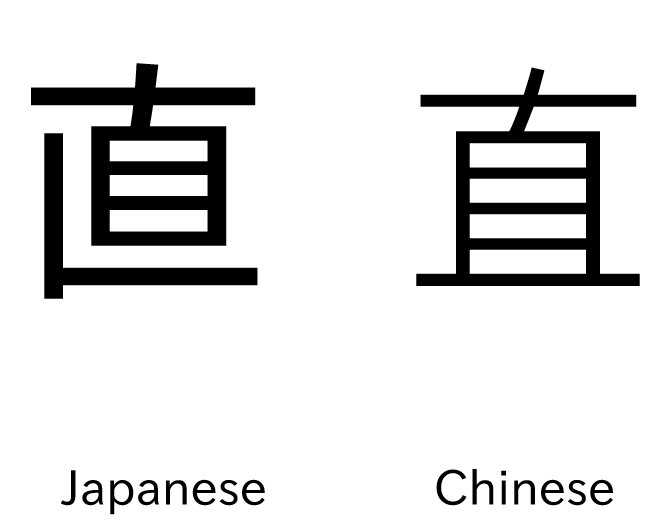

Are you using a Japanese font? 
===

{ align=left, width=200 }

How does 直 display for you?

This is really important for Anki, Yomitan, your browser etc.  
Source: [Guide: Are you using the right font?](https://learnjapanese.moe/guide/#are-you-using-the-right-font)

# Installation for Windows

- Press `WinKey`
- Search `Power Shell`
- Right-click `Open as administrator`
- Enter: 
`
Get-WindowsCapability -Online -Name Language.Fonts.Jpan~~~und-JPAN* | Add-WindowsCapability -Online
`

# Apply font for Chrome

- Open Chrome
- Open the menu `⋮`
- Settings
- Appearance
- Customize fonts

Select the following fonts:
- Standard font: `Meiryo UI`  
- Serif font: `Yu Mincho `
- Sans-serif font: `Meiryo`  
- Monospace: `MS Gothic`

Source: [The Moe Way](https://learnjapanese.moe/font/)

# Apply font for Anki

#### Reviewing
Check if `直` gets displayed correctly on the cards while reviewing:
- Click on browse
- Select / create a card with `直`

If it does not display correctly, the font is installed incorrectly or not detected.  
Please ask for help or see: [The Moe Way Font Anki](https://learnjapanese.moe/font/#anki).  
Maybe you need to force it.

#### Edit fields 
Check if `直` gets displayed correctly in the edit fields in the note type.
If not, you can change the font for every edit field.  
This is not really necessary but still good to see the kanji displayed correctly in the edit fields. 
- Click on `Fields` 
- Select a field where Japanese text is supposed to be displayed
- Change `Editing Font` to a Japanese font:
- e.g., `Noto Sans JP`

# Don't like Meiryo UI?

#### Noto Sans JP

If you like, you can use the [Noto Sans JP](https://fonts.google.com/noto/specimen/Noto+Sans+JP) font.

